scaemv is an interactive tool harboring several widgets:

- :ref:`Residual/Distance <fig-scaemv-residualdistance>`
- :ref:`Residual/Azimuth <fig-scaemv-residualazimuth>`
- :ref:`Residual/TakeOffs <fig-scaemv-residualtakeoffs>`
- :ref:`Particle motion <fig-scaemv-particlemotion>`
- :ref:`Magnitude density <fig-scaemv-magnitudedensity>`
- :ref:`Drift to hypocenters <fig-scaemv-drifttohypocenters>`
- :ref:`Gutenberg Richter <fig-scaemv-gutenbergrichter>`
- :ref:`Wadati diagram <fig-scaemv-wadati>`
- :ref:`Cross section <fig-scaemv-crosssection>`
- :ref:`Event energy <fig-scaemv-evtenergy>`
- :ref:`Events type variation <fig-scaemv-evttype>`
- :ref:`Events phase duration <fig-scaemv-evtphase>`
- :ref:`Magnitude variation <fig-scaemv-magnitudevariation>`
- :ref:`Uncertainties <fig-scaemv-uncertainties>`
- :ref:`Events map <fig-scaemv-eventsmap>`
- :ref:`Events topography map <fig-scaemv-eventstmap>`
- :ref:`Station stream <fig-scaemv-stationstream>`

Events list
===========

The events list displayed by scaemv is customizable. Columns can be dynamically
shown or hidden, events and origins filtered.

.. figure:: media/scbev/ctx_header.png
   :width: 14cm
   
   Header context menu.

.. figure:: media/scbev/evnt_filters.png
   :width: 20cm
   
   Miscellaneous filters.

When retrieving large timewindows of events, requests can be heavy on the
database, therefore it is better practice to use a secondary thread (other than
the one used by the gui), and also, use the cache engine can help speed up
this process.

.. code-block:: sh

   # Should the GUI be using a separate thread to fetch objects ?
   # @note the interface will be responsive but this will input some delay on the
   #       entire operation
   aemv.eventList.useSeparateThread = true
   
   # Should the GUI be using a cache to store objects
   # @note using a cache engine will reduce the time required to fetch objects
   #       but in the mean time, you should clear/refresh this cache periodically
   #       to ensure that objects are up to date  
   aemv.eventList.useCacheEngine = true

It is possible to filter events by locators.

.. code-block:: sh

   # Locators name
   aemv.locators = LOCSAT, Hypo71,Earthworm, NonLinLoc
   
   # Locator LOCSAT
   aemv.locator.LOCSAT.profiles = iasp91, tab
   
   # Locator Hypo71
   aemv.locator.Hypo71.profiles = "OVSM Dorel Volcanic", "OVSM Dorel Tectonic", "OVSM Landslide"

   # Locator Earthworm
   aemv.locator.Earthworm.profiles = "EW Dorel profile"
   
   # Locator NonLinLoc
   aemv.locator.NonLinLoc.profiles = ak135_global, iasp91_global

It is possible to filter events by type from scratch.

.. code-block:: sh

   # Default origin type filters.
   # @note Those options set the application default event list composition.
   #       They are also configurable dynamically by using tool button but won't
   #       by saved when exiting.
   
   # Show/Hide events flagged with 'not existing' type
   aemv.showNotExistingOrigins = false
   
   # Show/Hide events flagged with 'not locatable' type
   aemv.showNotLocatableOrigin = false
   
   # Show/Hide events without type
   aemv.showOriginsWithNoType = false
   
   # Show/Hide events flagged with 'outside of network interests' type
   aemv.showOutOfNetworkInterestsOrigins = true
   
   # Authorize events deletion
   aemv.eventList.allowAdvancedOptions = true

   # Highlight events row whenever an interaction occurs
   # @e.g. Objects selected in cross section will be highlighted with a
   #       distinctive color
   aemv.eventList.decorateItems = true
   
   # Draw pins when an event is selected
   aemv.eventList.paintPinBox = true;
   
   # Draw shadow around selected event's pin
   aemv.eventList.paintPinsShadow = false

   # Fetch orphan origins
   aemv.eventList.fetchUnassociatedOrigins = false

   # Fetch preferred origins comments
   aemv.eventList.fetchPreferredOriginComment = false
   
   # Fetch secondary origins comments
   aemv.eventList.fetchSiblingOriginComment = false # 'sibling' a.k.a. 'not preferred'
   
   # Fetch orphan origins comments
   aemv.eventList.fetchUnassociatedOriginComment = false

.. note:: Those options are editable within the configuration menu at runtime.
             
          .. figure:: media/scaemv/config_filters.png
             :width: 12cm
                
             Events types filters.

.. _fig-scaemv-residualdistance:

Residual/Distance
=================

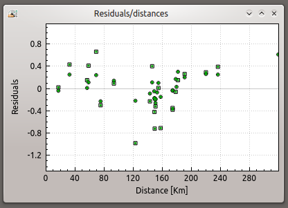

.. _fig-scaemv-residualazimuth:

Residual/Azimuth
================

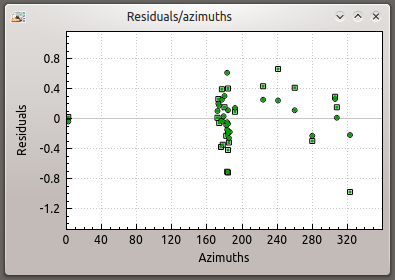

.. _fig-scaemv-residualtakeoffs:

Residual/TakeOffs
=================

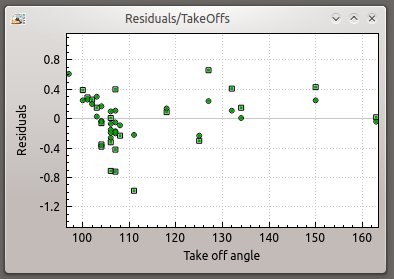
   

.. _fig-scaemv-particlemotion:

Particle Motion
===============

scaemv ships with a particle motion viewer accessible through the menu
**File**, **Graphics**, **Origin** then **Particle Motion**. It is also
possible to display this widget by using the XYZ button in the summary toolbox.

.. figure:: media/scaemv/pm_tabstations.png
   :width: 20cm

   Particle motion window.

Data loading
------------

Based upon the same API as scolv, scrttv and others, traces are displayed by
using Seedlink and Arclink requests. It is possible to apply basic and
customized stream filters.

.. code-block:: sh

   # Seedlink/Arclink URI service
   recordstream.uri = combined://seedserver:18000;arcserver:18001??rtMax=86400

   # Stream filters
   picker.filters = "BP 1 - 15 Hz 3rd order;BW(3,1,15)",\
                     "HP 1.5 3rd order;BW_HP(3,1.5)",\
                     "HP 3 n3;BW_HP(3,3)",\
                     "Landslide - BP 1 - 4 Hz n4;BW(4,1,4)",\
                     "BP 0.7 - 2 Hz;BW(3,0.7,2)",\
                     "4 pole HP @2s;BW_HP(4,0.5)",\
                     "4 pole LP @2s;BW_LP(4,0.5)"

.. warning:: Only valid arrivals are loaded.

The first phase of this process is the connection to the waveform server. The
default waiting delay is 30 seconds, otherwise, the application stops the
request and closes the connection.

.. code-block:: sh

   # Maximum delay before calling it quit (connection + data receive timeout)
   recordstream.timeout = 30

Miniseed packets are received station by station. Therefore the data quality
control is executed at the end, when all stations have been accounted for.

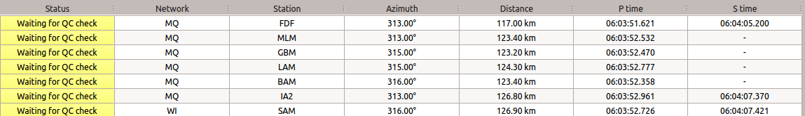

   Waiting for data quality control.

Once the entire pool of data has been verified, the user is informed of their
state. Graphics generated from a region containing gaps couldn't be properly
generated.

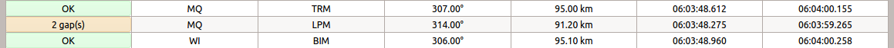

   Quality control completed.

Region selection
----------------

It is possible to select a region to be analyzed by double clicking through
the traces.

If the selected station streams contains picks P and S, the default selected
region of the analysis will be the interval defined by those picks.

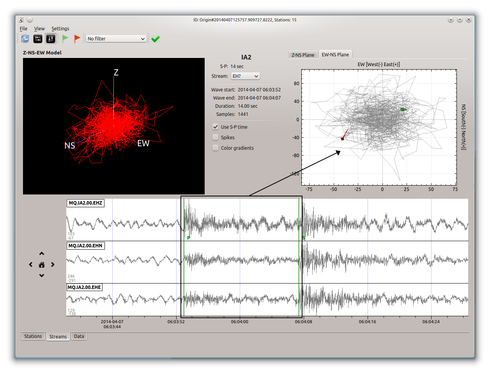

   Default region between P and S  picks.

Green (start) and red (end) flags from the toolbar make it possible to 
redefine the selected region of region of interest to be analyzed.

Filter selection
----------------

Filters can be applied to streams

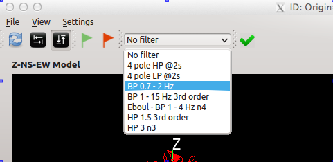

   Filter application.

Change active sensor
--------------------

The default behavior of this widget is to display data from the station
seismometer. If the station dispose of more than one sensor, it is possible
to display them aswell.

Use the **Stream** combo box

  .. figure:: media/scaemv/pm_streamselectiona.png
     :width: 6cm

     Sensor selection.

Exporting data
--------------

Data (time / counts) from the selected region can be exported.

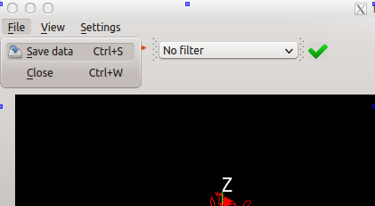

   Data export.

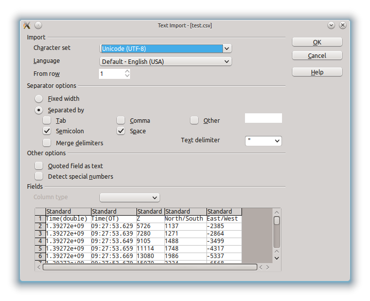

   CSV format export.

.. _fig-scaemv-magnitudedensity:

Magnitude density
=================

This widget displays the repartition of seismics events by latitudes, longitudes
and depths.

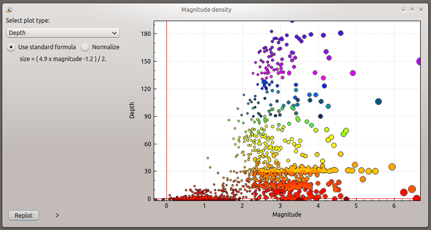
   
   Magnitude density widget.

.. _fig-scaemv-drifttohypocenters:

Drift to hypocenters
====================

This widget displays the temporal distribution of seismic hypocenters throughout
time by latitudes, longitudes and depths.

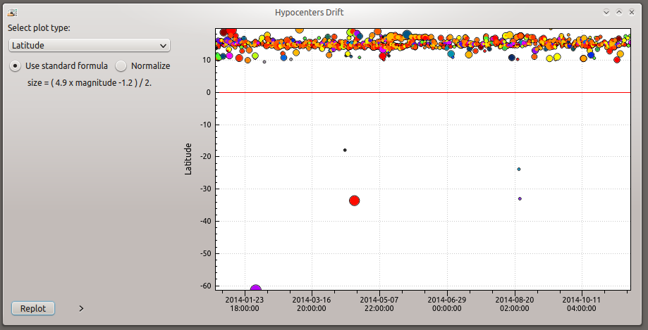
   
   Hypocenters drift widget.

.. _fig-scaemv-gutenbergrichter:

Gutenberg Richter
=================

This widget displays the expression of the Gutenberg and Richter law applied
to a seismic catalog.

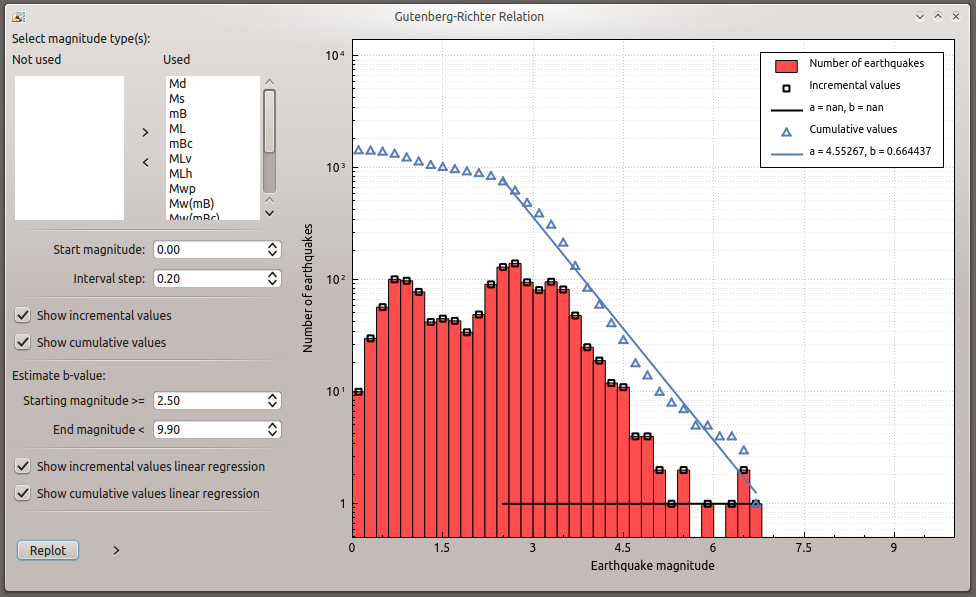
   
   Gutenberg-Richter widget.
   

.. _fig-scaemv-wadati:

Wadati diagram
==============

This widget displays the expression of the Wadati law applied to a seismic
catalog.

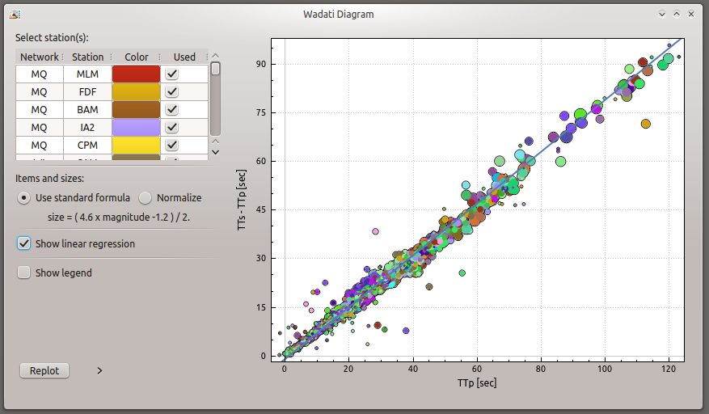
   
   Wadati diagram widget.

.. _fig-scaemv-crosssection:

Cross section
=============

Associated with the Events map, this widget displays latitudes and longitudes
cross section of events inside a zone of interest.

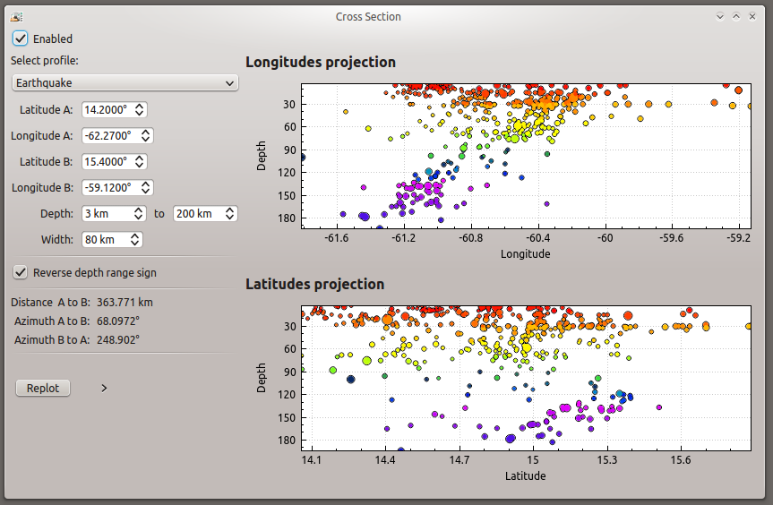
   
   Events Map and Cross section widgets.

The user may define as much cross section profiles as wanted.

.. code-block:: sh
   
   # Cross section's profiles
   crossSection.profiles = Earthquake, Volcano
   crossSection.profile.Earthquake.latitude.a = 14.2
   crossSection.profile.Earthquake.longitude.a = -62.27
   crossSection.profile.Earthquake.latitude.b = 15.4
   crossSection.profile.Earthquake.longitude.b = -59.12
   crossSection.profile.Earthquake.width = 80
   crossSection.profile.Earthquake.depthMin = 3
   crossSection.profile.Earthquake.depthMax = 200
   crossSection.profile.Volcano.latitude.a = 14.807
   crossSection.profile.Volcano.longitude.a = -61.18
   crossSection.profile.Volcano.latitude.b = 14.815
   crossSection.profile.Volcano.longitude.b = -61.156
   crossSection.profile.Volcano.width = 1
   crossSection.profile.Volcano.depthMin = -1
   crossSection.profile.Volcano.depthMax = 3
   ...

.. _fig-scaemv-evtenergy:

Event energy
============

This widget displays the accumulated seismic energy of the events timewindow.

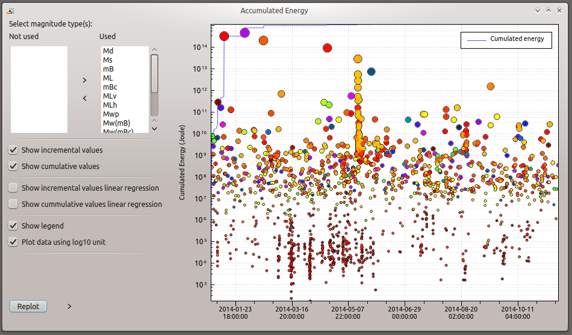
   
   Events energy widget.
   
   
.. _fig-scaemv-evttype:

Events type variation
=====================

This widget displays the evolution of the number of events categorized in types
throughout time.

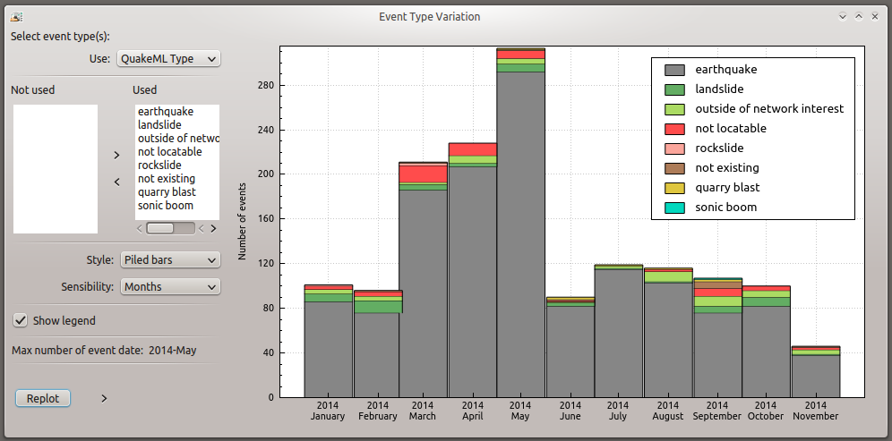
   
   Events type variation widget.

.. _fig-scaemv-evtphase:

Events phase duration
=====================

This widget displays the evolution of the S-P duration for each station over
time.

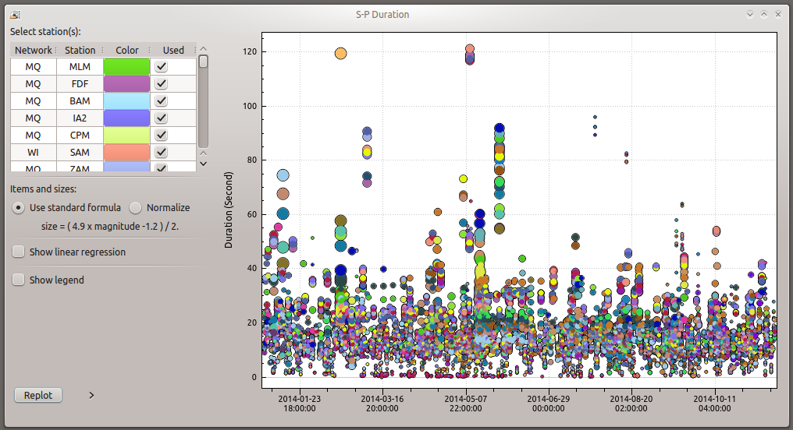
   
   Events phase duration widget.

.. _fig-scaemv-magnitudevariation:

Magnitude variation
===================

This widget displays variations of magnitudes over time.

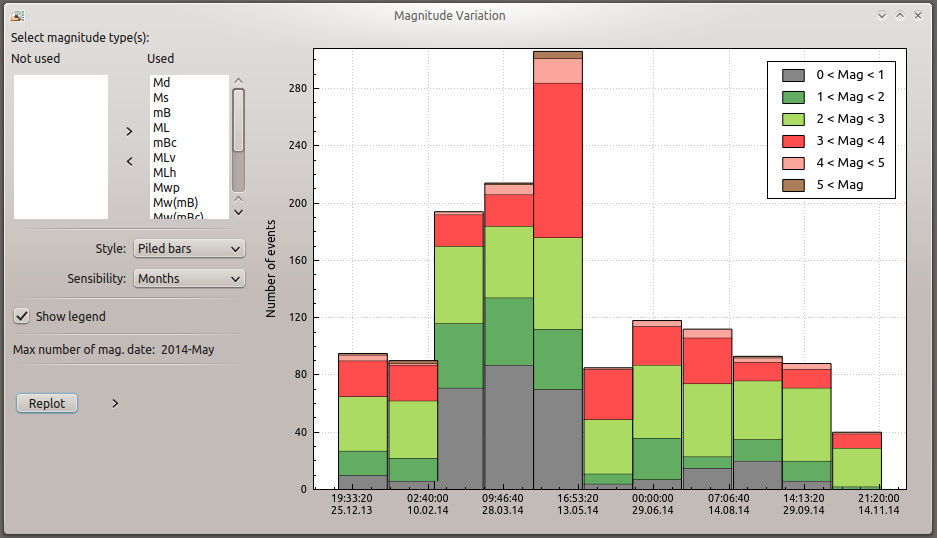
   
   Stacked cummulated magnitudes.
   
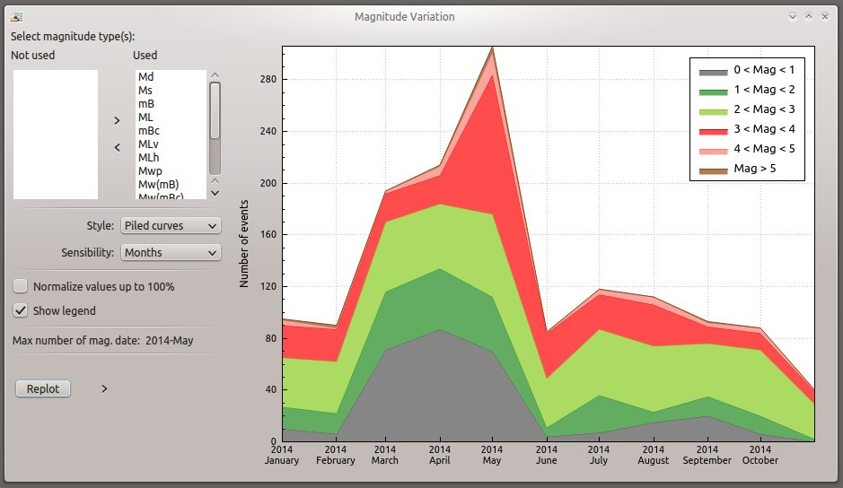
   
   Cummulated magnitudes curves.
   
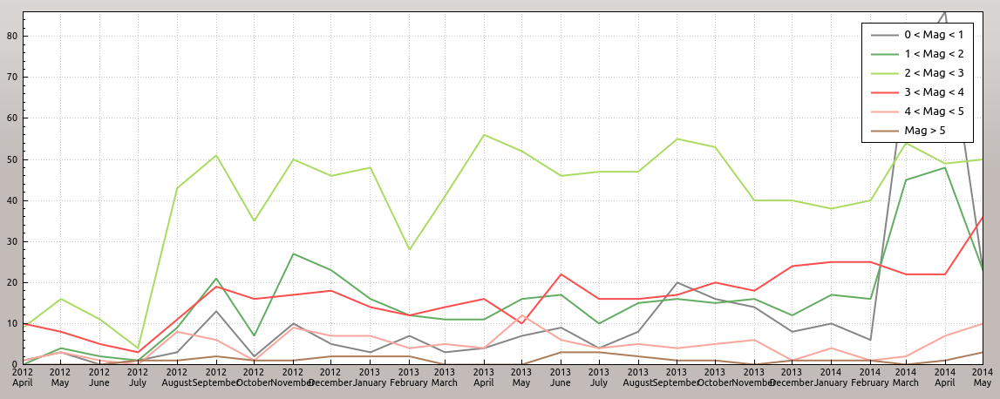
   
   Magnitudes curves.

.. _fig-scaemv-uncertainties:

Uncertainties
=============

This widget displays latitudes, longitudes, depths, RMSs, phases and magnitudes
uncertainties for the events timewindow.

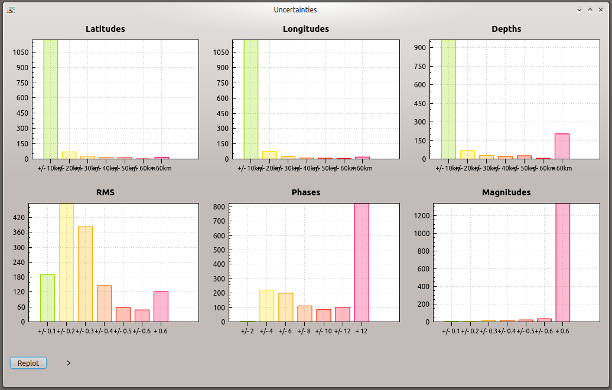
   
   Uncertainties widget.

.. _fig-scaemv-eventsmap:

Events map
==========

This widget displays a geographic map on which events from the catalog are
plotted. This widget is interactive. Symbols can be clicked on and vice-versa,
the user can pin point origins by selection from the events list.

Display properties:

.. code-block:: sh

   # Display pin to highlight a POI (Point Of Interest) on the map whenever
   # an object receives a click
   aemv.eventMap.paintPins = true
   
   # Accompany pins with information boxes
   aemv.eventMap.paintPinsWithBox = true
   
   # @note Graphic effect
   #       Activate this option to emphasis pins shadow, this option is not
   #       to be applied on low budget CPUs...
   aemv.eventMap.paintPinsWithShadow = false
   
   # Auto clear pins from map
   aemv.eventMap.clearPinsAuto = true
   
   # Pins clearing delay (in seconds)
   aemv.eventMap.clearPinsDelay = 5

.. _fig-scaemv-stationstream:

Station stream
==============

Ce widget permet d'afficher l'ensemble des flux actifs en temps réel des
stations de l'inventaire.

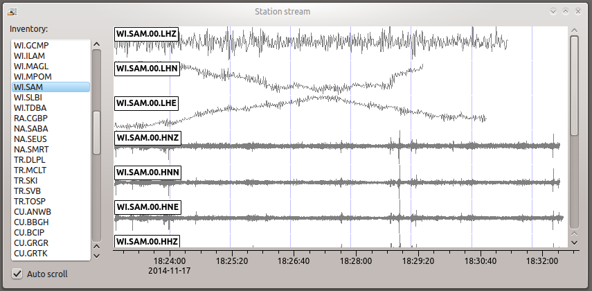
   
   Widget station stream.

Widgets interactions
====================

Each widget gets data from the main events list. Therefore, whenever the latter
changes, their pool of events, origns, etc also evoluates.
Most of them are able to signal events and or origins so that the matching
entity could be highlighted on the map, or the events list.

Keyboard shortcuts
==================

The following table describes available shortcuts and their actions.

+----------------------+-------------------------------------------------------------+
| Shortcut             | Description                                                 |
+======================+=============================================================+
| F1                   | Displays the online help index                              |
+----------------------+-------------------------------------------------------------+
| Shift+F1             | Displays this application online help                       |
+----------------------+-------------------------------------------------------------+
| F2                   | Displays the connection configuration dialog                |
|                      | connections (db / master)                                   |
+----------------------+-------------------------------------------------------------+
| F3                   | Displays the application configuration dialog               |
+----------------------+-------------------------------------------------------------+
| F8                   | Shows/hides summary widget                                  |
+----------------------+-------------------------------------------------------------+
| F9                   | Displays the application log                                |
+----------------------+-------------------------------------------------------------+
| Ctrl+Shift+D         | Displays Residual/Distance widget                           |
+----------------------+-------------------------------------------------------------+
| Ctrl+Shift+A         | Displays Residual/Azimuth widget                            |
+----------------------+-------------------------------------------------------------+
| Ctrl+Shift+R         | Displays Residual/TakeOffs widget                           |
+----------------------+-------------------------------------------------------------+
| Shift+P              | Displays Particle Motion widget                             |
+----------------------+-------------------------------------------------------------+
| Shift+D              | Displays Magnitude density widget                           |
+----------------------+-------------------------------------------------------------+
| Ctrl+Shift+H         | Displays Drift to hypocenters widget                        |
+----------------------+-------------------------------------------------------------+
| Ctrl+Shift+G         | Displays Gutenberg-Richter relation widget                  |
+----------------------+-------------------------------------------------------------+
| Ctrl+Shift+W         | Displays Wadati relation widget                             |
+----------------------+-------------------------------------------------------------+
| Ctrl+Shift+Z         | Displays Cross section widget                               |
+----------------------+-------------------------------------------------------------+
| Ctrl+Shift+E         | Displays Event Energy widget                                |
+----------------------+-------------------------------------------------------------+
| Ctrl+Shift+T         | Displays Event Type Variation widget                        |
+----------------------+-------------------------------------------------------------+
| Ctrl+Shift+P         | Displays Event Phase Duration widget                        |
+----------------------+-------------------------------------------------------------+
| Ctrl+Shift+V         | Displays Magnitude variation widget                         |
+----------------------+-------------------------------------------------------------+
| Ctrl+Shift+U         | Displays Uncertainties widget                               |
+----------------------+-------------------------------------------------------------+
| Shift+M              | Displays Events Map widget                                  |
+----------------------+-------------------------------------------------------------+
| Shift+T              | Displays Topography Map widget                              |
+----------------------+-------------------------------------------------------------+
| Ctrl+Shift+L         | Displays Station stream widget                              |
+----------------------+-------------------------------------------------------------+

Units and decimals
==================

scwev can be configured to display information according to user's preferences.

.. code-block:: sh

   # If true, show distances in km. Use degree otherwise.
   scheme.unit.distanceInKM = true

The same goes for the number of decimals:

.. code-block:: sh

   # Default precision
   scheme.precision.general = 2
   
   # Precision of depth values.
   scheme.precision.depth = 0
   
   # Precision of lat/lon values.
   scheme.precision.location = 2
   
   # Distances
   scheme.precision.distance = 2
   
   # R.M.S
   scheme.precision.rms = 1
   
   # Azimuth
   scheme.precision.azimuth = 0
   
   # Precision of pick times (fractions of seconds).
   scheme.precision.pickTime = 1

Map
===

The displayed map(s) are based upon normalized tiles (256x256 pixels). The user
may choose to use simultaniously several tile designs, therfore it is possible
to specify more than one tile design.

.. code-block:: sh

   # Tile design names
   map.names = "ESRI - Ocean Basemap", "Google - Hybrid Sat/Terrain",\
               "OpenStreetMap - Terrain"

   # Tile design paths (ordered)
   map.paths = ${HOME}/.ipgp/maps/esri/Ocean_Basemap/,\
               ${HOME}/.ipgp/maps/gmap-hybrid/,\
               ${HOME}/.ipgp/maps/opencyclemap/

Tiles
-----

Tiles are organized in different zoom levels, columns and lines, the user
should specify the way they are stored.

.. code-block:: sh

   # OpenStreetMap's default tile pattern is "%1/%2/%3", the tile
   # engine is configured to use less sub-folders...
   # - %1 = zoom level (0-*)
   # - %2 = column (0- 2^zoom-1)
   # - %3 = line (0- 2^zoom-1 in Mercator projection)
   # Each parameter can be used more than once.
   # @note It is not mandatory to specify the extension of the file, the
   #       algorithm will try and fetch PNG and JPG files
   map.tilePattern = "%1/osm_%1_%2_%3"

More information about tiles 
`OpenStreetMap slippy map <http://wiki.openstreetmap.org/wiki/Slippy_map_tilenames>`_

Objects
-------

Objects are organized by canvas in wich several layers and decorators
are registered. Tiles are part of the background canvas whereas objects like
epicenters, stations, etc, are called drawables and painted by the foreground
canvas. Decorators may overpaint the foreground canvas.

Application execution
=====================

scbev can be launched by using the standard command.

.. code-block:: sh

   seiscomp exec scaemv
   

 