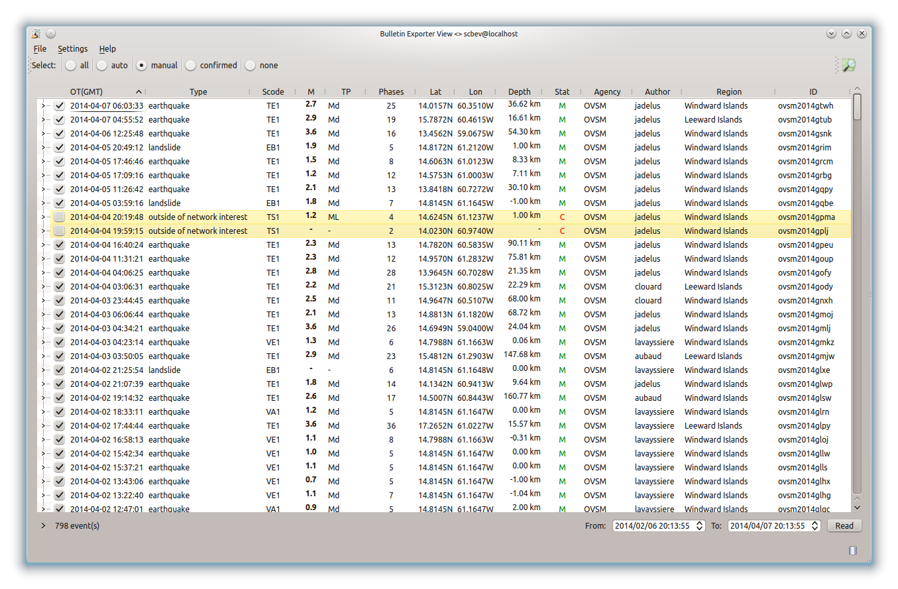
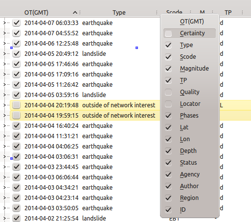
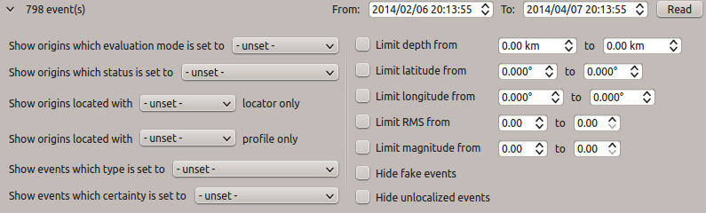

scbev is an interactive tool for publishing catalogs and bulletins in various
formats:

- :ref:`HYPOINVERSE <fig-scbev-hypoinverse>`
- :ref:`GSE 2.0 <fig-scbev-gse2.0>`
- :ref:`IMS 1.0 <fig-scbev-ims1.0>`
- :ref:`QuakeML <fig-scbev-quakeml>`

   scbev interface.

Events list
===========

The events list displayed by scaemv is customizable. Some columns can be
dynamically shown or hidden, events and origins filtered.

   
   Headers context menu.

   
   Miscellaneous filters.

Requests may be heavy on the database, it is best practice to use a secondary
thread (other that the one used by the gui), and also use the cache engine
can help speed up the process.

.. code-block:: sh

   # Should the GUI be using a separate thread to fetch objects ?
   # @note the interface will be responsive but this will input some delay on the
   #       entire operation
   bev.eventList.useSeparateThread = true
   
   # Should the GUI be using a cache to store objects
   # @note using a cache engine will reduce the time required to fetch objects
   #       but in the mean time, you should clear/refresh this cache periodically
   #       to ensure that objects are up to date  
   bev.eventList.useCacheEngine = true

It is possible to filter events by locators.

.. code-block:: sh

   # Locators name
   bev.locators = LOCSAT, Hypo71,Earthworm, NonLinLoc
   
   # Locator LOCSAT
   bev.locator.LOCSAT.profiles = iasp91, tab
   
   # Locator Hypo71
   bev.locator.Hypo71.profiles = "OVSM Dorel Volcanic", "OVSM Dorel Tectonic", "OVSM Landslide"

   # Locator Earthworm
   bev.locator.Earthworm.profiles = "EW Dorel profile"
   
   # Locator NonLinLoc
   bev.locator.NonLinLoc.profiles = ak135_global, iasp91_global

It is possible to filter events by type from scratch.

.. code-block:: sh

   # Default origin type filters.
   # @note Those options set the application default event list composition.
   #       They are also configurable dynamically by using tool button but won't
   #       by saved when exiting.
   
   # Show/Hide events flagged with 'not existing' type
   bev.showNotExistingOrigins = false
   
   # Show/Hide events flagged with 'not locatable' type
   bev.showNotLocatableOrigin = false
   
   # Show/Hide events without type
   bev.showOriginsWithNoType = false
   
   # Show/Hide events flagged with 'outside of network interests' type
   bev.showOutOfNetworkInterestsOrigins = true
   
   # Authorize events deletion
   bev.eventList.allowAdvancedOptions = true

   # Highlight events row whenever an interaction occurs
   # @e.g. Objects selected in cross section will be highlighted with a
   #       distinctive color
   bev.eventList.decorateItems = true
   
   # Draw pins when an event is selected
   bev.eventList.paintPinBox = true;
   
   # Draw shadow around selected event's pin
   bev.eventList.paintPinsShadow = false

   # Fetch orphan origins
   bev.eventList.fetchUnassociatedOrigins = false

   # Fetch preferred origins comments
   bev.eventList.fetchPreferredOriginComment = false
   
   # Fetch secondary origins comments
   bev.eventList.fetchSiblingOriginComment = false # 'sibling' a.k.a. 'not preferred'
   
   # Fetch orphan origins comments
   bev.eventList.fetchUnassociatedOriginComment = false

.. note:: Those options are editable within the configuration menu at runtime.
             
          .. figure:: media/scaemv/config_filters.png
             :width: 12cm
                
             Events types filters.

.. _fig-scbev-hypoinverse:

HYPOINVERSE
===========

Historical formal of Hypo71, a program for resolving seismic positions and
magnitudes, HYPOINVERSE (HYPO2000) has been developed by USGS (Fred Klein).

This format is composed of:

* a catalog containing a summary list of events

  .. code-block:: sh

     20140407 0603 33.68 14-00.94  60-21.05  36.62 D 2.68 24 286 67.3 0.08  1.0  5.0 C  TE1   20140407_060300_a.mq0
     20140407 0455 52.04 15-47.23  60-27.69  16.61 D 2.88 18 244 87.0 0.13  1.2  2.7 C  TE1   20140407_045500_a.mq0
     20140406 1225 48.75 13-27.37  59-04.05  54.30 D 3.59 15 343215.5 0.17 13.4110.6 D  TE1   20140406_122500_a.mq0
     20140405 2049 12.75 14-49.03  61-12.72   1.00 D 1.93  4 319  0.3 0.10           C  EB1   20140405_204900_a.mq0
     20140405 1746 46.68 14-36.37  61-00.73   8.33 D 1.50  7 260  2.6 0.03  0.4  0.3 C  TE1   20140405_174600_a.mq0
     20140405 1709 16.58 14-34.51  61-00.01   7.11 D 1.16 11 109  2.7 0.11  0.4  0.6 B  TE1   20140405_170900_a.mq0
     20140405 1126 42.39 13-50.50  60-43.63  30.10 D 2.08 12 250 27.4 0.13  2.7  5.6 D  TE1   20140405_112600_a.mq0
     20140405 0359 16.67 14-48.87  61-09.86  -1.00 D 1.78  6 175  0.3 0.11  0.4  0.6 B  EB1   20140405_035900_a.mq0
     20140404 1640 24.98 14-46.92  60-35.01  90.11 D 2.29 12 305 45.9 0.13 10.7  9.2 D  TE1   20140404_164000_a.mq0
     ...

* a bulletin referencing picks associated to the catalog's events

  .. code-block:: sh

     FDF EP 2 14040706 351.62       65.20ES 3                                      M=2.7 TE1   20140407_060300_a.mq0
     MLM EP 2 14040706 352.53                                                      
     GBM EP 0 14040706 352.47                                                      
     LAM EP 2 14040706 352.78                                                      
     BAM EP 2 14040706 352.36                                                      
     IA2 EP 2 14040706 352.96       67.37ES 2                                      
     ZAM EP 0 14040706 348.88       60.32ES 2                                      
     TRM EP 2 14040706 348.61       60.16ES 2                                      
     LPM EP 1 14040706 348.28       59.27ES 1                                      
     BIM EP 2 14040706 348.96       60.26ES 3                                      
     ...

The link between catalog and bulletin is done by a commune reference that is
specifiable by the user:

* the event's publicID
* the origin's publicID
* an expression

.. code-block:: sh

   # HYPOINVERSE LINKER
   # @note The user may choose between:
   #         - "%eventID%"
   #         - "%originID%"
   #         - custom patternID -> bev.%Y%m%d_%H%M%S.%f_mq0
   bev.export.instituteTag = %Y%m%d_%H%M00_a.mq0

.. _fig-scbev-gse2.0:

GSE 2.0
=======

Developed for the Group of Scientific Experts, and tested, experimented with
by the FDSN (Federation of Digital Seismograph Networks), this format has
proved itself worthy of international data exchange.
Structured to be mainly exchanged by e-mails, it is based upon AutoDRM, an
automated system designed to exchange data on demand.

Sample message:

.. code-block:: sh

   BEGIN GSE2.0
   MSG_TYPE DATA
   MSG_ID 2014/04/08_124357 REV_OVSM
   DATA_TYPE BULLETIN GSE2.0
   EVENT ovsm2014gtwh Windward Islands
       Date      Time       Latitude Longitude    Depth    Ndef Nsta Gap    Mag1  N    Mag2  N    Mag3  N  Author          ID
          rms   OT_Error      Smajor Sminor Az        Err   mdist  Mdist     Err        Err        Err     Quality

   2014/04/07 06:03:33.6    14.0157  -60.3510      36.6      25   24 286             ML 2.8  9  Md 2.7 11  Bulletin  L1l0HErO
         0.08   +-  0.00                   286    +-  5.0    0.61   1.15   +-         +-0.2      +-0.2     m i ke

   Sta     Dist  EvAz     Phase      Date       Time     TRes  Azim  AzRes  Slow  SRes Def   SNR       Amp   Per   Mag1   Mag2       ID
   FDF     1.05 313.0 m i P       2014/04/07 06:03:51.6  -0.0  95.0                          2.0       0.3       ML 2.6        7dx0atQd
   FDF     1.05 313.0 m i S       2014/04/07 06:04:05.2  -0.1  95.0                                                            Q7CoA40c
   MLM     1.11 313.0 m i P       2014/04/07 06:03:52.5   0.1  95.0                          5.4       0.8       ML 3.0        pE6iTdjs
   GBM     1.11 315.0 m i P       2014/04/07 06:03:52.4   0.0  95.0                          6.3       0.8       ML 3.0        5sgAXyeS
   LAM     1.12 315.0 m i P       2014/04/07 06:03:52.7   0.1  95.0                                    1.4       ML 3.3        zBHxTnAz
   BAM     1.11 316.0 m i P       2014/04/07 06:03:52.3  -0.1  95.0                          4.7       0.8       ML 3.0        i2LGVCGa
   IA2     1.14 313.0 m i P       2014/04/07 06:03:52.9   0.2  94.0                                    0.6       ML 2.9        4DiLGp1z
   IA2     1.14 313.0 m i S       2014/04/07 06:04:07.3   0.1  94.0                                                            H7Yst29Q
   SAM     1.14 316.0 m i S       2014/04/07 06:04:07.4   0.0  94.0                                                            sGdbRByZ
   ZAM     0.86 311.0 m i P       2014/04/07 06:03:48.8        97.0                                    1.0       ML 3.0        savdA2bu
   ZAM     0.86 311.0 m i S       2014/04/07 06:04:00.3  -0.1  97.0                                                            th5XuWlZ
   TRM     0.85 307.0 m i P       2014/04/07 06:03:48.6  -0.2  97.0                                  180.7 31.52 Md 2.5        R9ib1fPj
   LPM     0.82 314.0 m i P       2014/04/07 06:03:48.2  -0.0  98.0                                    0.5       ML 2.7        LTisiHfA
   LPM     0.82 314.0 m i S       2014/04/07 06:03:59.2  -0.1  98.0                                                            FAB5qCpH
   BIM     0.86 306.0 m i P       2014/04/07 06:03:48.9   0.1  97.0                                    0.6       ML 2.8        Hkv14ERL
   BIM     0.86 306.0 m i S       2014/04/07 06:04:00.2  -0.1  97.0                                                            DXKs2qCB
   MPOM    0.65 311.0 m i P       2014/04/07 06:03:46.1   0.1 101.0                          1.4       0.4       ML 2.5        7IRffUGK
   MPOM    0.65 311.0 m i S       2014/04/07 06:03:55.3  -0.0 101.0                                                            i7FzyU43
   SLBI    0.61 271.0 m i P       2014/04/07 06:03:45.3  -0.0 103.0                          1.4       0.4       ML 2.5        2pVURAwk
   SLBI    0.61 271.0 m i S       2014/04/07 06:03:54.2   0.1 103.0                                                            l6Ddk3Ch
   MCLT    0.65 242.0 m i P       2014/04/07 06:03:45.9  -0.1 101.0                          1.5       0.4       ML 2.4        BhlH1Rf7
   TRM     0.85 307.0 m i S       2014/04/07 06:04:00.1  -0.1  97.0                                                            MLw8tp2k
   SAM     1.14 316.0 m i P       2014/04/07 06:03:52.7  -0.1  94.0                                    2.3       ML 3.5        CN4kboum
   CPM     1.15 314.0 m i P       2014/04/07 06:03:53.1   0.2  94.0                          2.8       0.4       ML 2.7        jVntOPzg

   ...

   STOP

.. _fig-scbev-ims1.0:

IMS 1.0
=======

International Monitoring System 1.0 (IMS 1.0) is an IASPEI Seismic Format
(ISF) created by IRIS DMC. Very similar to the GSE format, only a few things
change.

Sample message:

.. code-block:: sh

   BEGIN IMS1.0
   MSG_TYPE DATA
   MSG_ID 2014/04/08_124906 REV_OVSM
   BULLETIN (IMS1.0:SHORT FORMAT)
   DATA_TYPE BULLETIN IMS1.0:short
   EVENT ovsm2014gtwh Windward Islands
      Date       Time        Err   RMS Latitude Longitude  Smaj  Smin  Az Depth   Err Ndef Nsta Gap  mdist  Mdist Qual   Author      OrigID
   2014/04/07 06:03:33.68   0.00  0.08  14.0157  -60.3510   0.0   0.0   0  36.6   5.0   25   24 286   0.61   1.15 g ke Bulletin  za3eeVqt

   Magnitude  Err Nsta Author      OrigID
   MLv    2.7 0.2   13 Bulletin  za3eeVqt
   ML     2.8 0.2    9 Bulletin  za3eeVqt
   Md     2.7 0.2   11 Bulletin  za3eeVqt
   Sta     Dist  EvAz Phase        Time      TRes  Azim AzRes   Slow   SRes Def   SNR       Amp   Per Qual Magnitude    ArrID
   FDF     1.05 313.0 P        06:03:51.621 -0.0   95.0                     ___   2.0       0.3       m__ MLv    2.6 u2l6ZoGd
   FDF     1.05 313.0 S        06:04:05.200 -0.1   95.0                     ___                       m__        0.0 Rvxnj0ft
   MLM     1.11 313.0 P        06:03:52.532  0.1   95.0                     ___   5.4       0.8       m__ MLv    3.0 xeqlZuup
   GBM     1.11 315.0 P        06:03:52.470  0.0   95.0                     ___   6.3       0.8       m__ MLv    3.0 sntx7JOr
   LAM     1.12 315.0 P        06:03:52.777  0.1   95.0                     ___             1.4       m__ ML     3.3 A0lpcSqR
   BAM     1.11 316.0 P        06:03:52.358 -0.1   95.0                     ___   4.7       0.8       m__ MLv    3.0 dM5lC8CZ
   IA2     1.14 313.0 P        06:03:52.961  0.2   94.0                     ___             0.6       m__ ML     2.9 bS90brdr
   IA2     1.14 313.0 S        06:04:07.370  0.1   94.0                     ___                       m__        0.0 FxOC4rRs
   SAM     1.14 316.0 S        06:04:07.421  0.0   94.0                     ___                       m__        0.0 h2HhKYXM
   ZAM     0.86 311.0 P        06:03:48.878        97.0                     ___             1.0       m__ ML     3.0 AQX0OpOP
   ZAM     0.86 311.0 S        06:04:00.319 -0.1   97.0                     ___                       m__        0.0 5NE64Hmx
   TRM     0.85 307.0 P        06:03:48.612 -0.2   97.0                     ___           180.7 31.52 m__ Md     2.5 2YZXfEdk
   LPM     0.82 314.0 P        06:03:48.275 -0.0   98.0                     ___             0.5       m__ ML     2.7 xLs5xdHV
   LPM     0.82 314.0 S        06:03:59.265 -0.1   98.0                     ___                       m__        0.0 TuLvHpbD
   BIM     0.86 306.0 P        06:03:48.960  0.1   97.0                     ___             0.6       m__ ML     2.8 0DxTaJg1
   BIM     0.86 306.0 S        06:04:00.258 -0.1   97.0                     ___                       m__        0.0 y4MDyPMV
   MPOM    0.65 311.0 P        06:03:46.146  0.1  101.0                     ___   1.4       0.4       m__ MLv    2.5 q2RN5mwM
   MPOM    0.65 311.0 S        06:03:55.336 -0.0  101.0                     ___                       m__        0.0 F87cn6Fe
   SLBI    0.61 271.0 P        06:03:45.327 -0.0  103.0                     ___   1.4       0.4       m__ MLv    2.5 z1Xyy1pW
   SLBI    0.61 271.0 S        06:03:54.241  0.1  103.0                     ___                       m__        0.0 V1oiG03V
   MCLT    0.65 242.0 P        06:03:45.911 -0.1  101.0                     ___   1.5       0.4       m__ MLv    2.4 SIwLTTno
   TRM     0.85 307.0 S        06:04:00.155 -0.1   97.0                     ___                       m__        0.0 Rkq2hU4E
   SAM     1.14 316.0 P        06:03:52.726 -0.1   94.0                     ___             2.3       m__ ML     3.5 LP29HfUq
   CPM     1.15 314.0 P        06:03:53.115  0.2   94.0                     ___   2.8       0.4       m__ MLv    2.7 66yBUqmA

   ...
   
   STOP

More information `PDF documentation` `<http://www.isc.ac.uk/standards/isf/download/ims1_0.pdf>`_

.. _fig-scbev-quakeml:

QuakeML
=======

QuakeML is an open standard developed with sole purpose of being transparent.
Based on XML format, it encapsulates seismic data in a more flexible,
extensible, luxuriant way than other.

Its base structure being XML, it is composed of nodes in which various
informations can be found.

Sample message:

.. code-block:: xml

   <q:quakeml xmlns:q="http://quakeml.org/xmlns/quakeml-rt/1.2" xmlns="http://quakeml.org/xmlns/bed-rt/1.2">
       <eventParameters publicID="smi:scs/0.7/NA-N0x1b309e0N0x1bdab00">
           <stationMagnitude publicID="smi:scs/0.7/StationMagnitude#20140219155602.884486.8169">
               <comment/>
                <originID>smi:scs/0.7/NLL.20140219155533.118353.8091</originID>
                <mag>
                    <value>6.477554536</value>
                </mag>
                <type>MLv</type>
                <amplitudeID>smi:scs/0.7/Amplitude#20140218132117.182366.2946</amplitudeID>
                <waveformID networkCode="CU" stationCode="ANWB" locationCode="00" channelCode="BHZ">smi:scs/0.7/NA-N0x1b309e0N0x1c02b28</waveformID>
                <creationInfo>
                    <agencyID>OVSM</agencyID>
                    <author>tartampion</author>
                    <creationTime>2014-02-19T15:56:02.884506Z</creationTime>
                </creationInfo>
            </stationMagnitude>
        ...
            <origin publicID="smi:scs/0.7/NLL.20140219155533.118353.8091">
                <time>
                    <value>2014-02-18T09:27:13.923195Z</value>
                </time>
                <latitude>
                    <value>14.71801758</value>
                    <uncertainty>2.421217758</uncertainty>
                </latitude>
                <longitude>
                    <value>-59.07348633</value>
                    <uncertainty>3.956615503</uncertainty>
                </longitude>
                <depth>
                    <value>10.66227214</value>
                    <uncertainty>6.500011675</uncertainty>
                </depth>
                <arrival publicID="smi:scs/0.7/NA-N0x1b309e0N0x1c41640">
                    <comment/>
                    <pickID>smi:scs/0.7/Pick#20140219145921.479921.7757</pickID>
                    <phase>S</phase>
                    <timeCorrection>0</timeCorrection>
                    <azimuth>145.9949597</azimuth>
                    <distance>11.50923644</distance>
                    <timeResidual>-18.5235464</timeResidual>
                    <timeWeight>0</timeWeight>
                </arrival>
            </origin>
       </eventParameters>
   </q:quakeml>

More information `QuakeML` `<https://quake.ethz.ch/quakeml/>`_

To generate an QuakeML file, scbev requires a schema model. This schema will
be used in order to convert data from SC3ML format into QuakeML format.

.. warning:: The version of the schema must be the same as the one used by
             the SeisComP3 database.

.. code-block:: sh

   # QuakeML schema
   bev.export.quakeml.schemaFile = @DATADIR@/scbev/sc3ml_0.7__quakeml_1.2.xsl

Also, this conversion is executed by using a third party program called **xalan**.
This program is available through the linux repositories.

.. code-block:: sh

   # On Debian
   apt-get install xalan
   
   # On Red Hat
   yum install xalan

Keyboard shortcuts
==================

The following table describes available shortcuts and their actions.

+----------------------+-------------------------------------------------------------+
| Shortcut             | Description                                                 |
+======================+=============================================================+
| F1                   | Displays the online help index                              |
+----------------------+-------------------------------------------------------------+
| Shift+F1             | Displays this application online help                       |
+----------------------+-------------------------------------------------------------+
| F2                   | Displays the connection configuration dialog                |
|                      | connections (db / master)                                   |
+----------------------+-------------------------------------------------------------+
| F3                   | Displays the application configuration dialog               |
+----------------------+-------------------------------------------------------------+
| F9                   | Displays the application log                                |
+----------------------+-------------------------------------------------------------+
| Ctrl+P               | Opens the catalogs and bulletins export dialog              |
+----------------------+-------------------------------------------------------------+
| Ctrl+Q               | Exits the application                                       |
+----------------------+-------------------------------------------------------------+
| Ctrl+M               | Opens the map export dialog                                 |
+----------------------+-------------------------------------------------------------+
| Ctrl+H               | Affiche les crédit de l'application                         |
+----------------------+-------------------------------------------------------------+

Units and decimals
==================

scwev can be configured to display information according to user's preferences.

.. code-block:: sh

   # If true, show distances in km. Use degree otherwise.
   scheme.unit.distanceInKM = true

The same goes for the number of decimals:

.. code-block:: sh

   # Default precision
   scheme.precision.general = 2
   
   # Precision of depth values.
   scheme.precision.depth = 0
   
   # Precision of lat/lon values.
   scheme.precision.location = 2
   
   # Distances
   scheme.precision.distance = 2
   
   # R.M.S
   scheme.precision.rms = 1
   
   # Azimuth
   scheme.precision.azimuth = 0
   
   # Precision of pick times (fractions of seconds).
   scheme.precision.pickTime = 1

Map
===

The displayed map(s) are based upon normalized tiles (256x256 pixels). The user
may choose to use simultaniously several tile designs, therfore it is possible
to specify more than one tile design.

.. code-block:: sh

   # Tile design names
   map.names = "ESRI - Ocean Basemap", "Google - Hybrid Sat/Terrain",\
               "OpenStreetMap - Terrain"

   # Tile design paths (ordered)
   map.paths = @DATADIR@/maps/esri/Ocean_Basemap/,\
               @DATADIR@/maps/gmap-hybrid/,\
               @DATADIR@/maps/opencyclemap/

Tiles
-----

Tiles are organized in different zoom levels, columns and lines, the user
should specify the way they are stored.

.. code-block:: sh

   # OpenStreetMap's default tile pattern is "%1/%2/%3", the tile
   # engine is configured to use less sub-folders...
   # map.tilePattern = "%1/osm_%1_%2_%3"
   # - %1 = zoom level (0-*)
   # - %2 = column (0- 2^zoom-1)
   # - %3 = line (0- 2^zoom-1 in Mercator projection)
   # Each parameter can be used more than once.
   # @note It is not mandatory to specify the extension of the file, the
   #       algorithm will try and fetch PNG and JPG files
   map.tilePattern = "%1/%2/%3"

More information about tiles 
`OpenStreetMap slippy map <http://wiki.openstreetmap.org/wiki/Slippy_map_tilenames>`_

Objects
-------

Objects are organized by canvas in wich several layers and decorators
are registered. Tiles are part of the background canvas whereas objects like
epicenters, stations, etc, are called drawables and painted by the foreground
canvas. Decorators may overpaint the foreground canvas.

Application execution
=====================

scbev can be launched by using the standard command.

.. code-block:: sh

   seiscomp exec scbev
