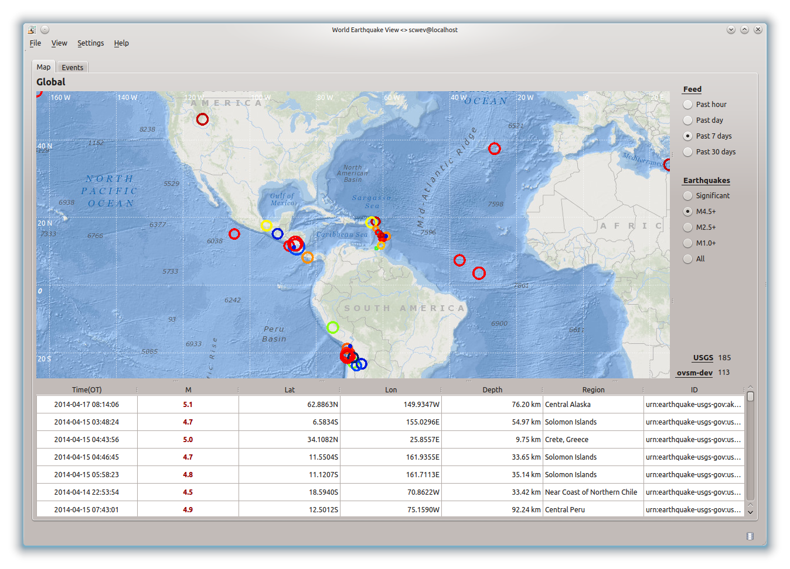
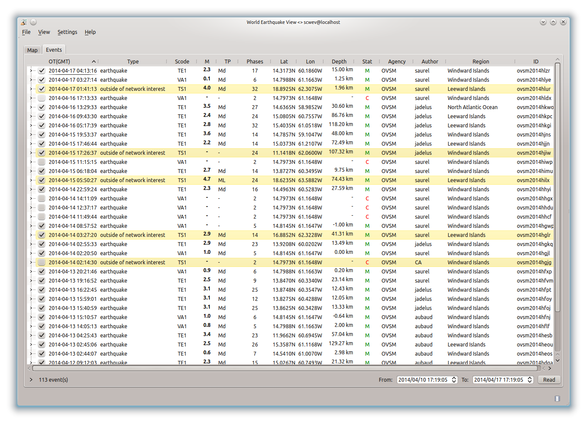
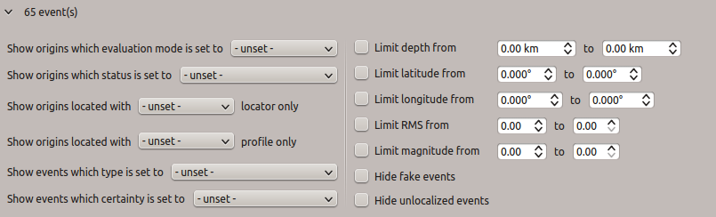
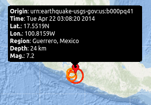
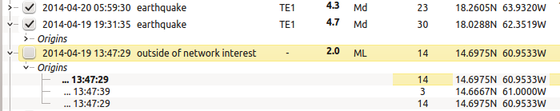
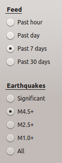
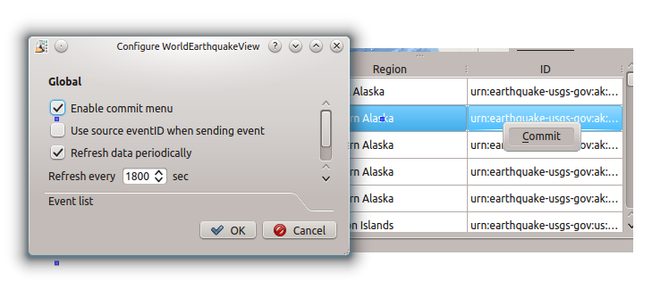

scwev is an interactive tool for displaying events issued by USGS (United
States Geological Survey) through RSS (Rich Site Summary) feeds.

Map tab
=======

Main tab of the application, it displays events from RSS data in an interactive
folding list, amalgamates those events with events from the local database
and plots both on the map.

   Map tab.

Events tab
=============

Displays events from the local database.

   Events tab.

Those events can be sorted to match user's preferences. A filtering menu
is available by clicking on the tick down left.

   Global filters.

.. figure:: media/scwev/eventlist_filters1.png
   :width: 12cm

   Event type filters available in application configuration dialog. Those
   specific events will be highlighted in the list.

Event type filters are pre-configurable in the application configuration file.

.. code-block:: sh

   # Display events which type is set to  'Fake'
   wev.eventList.showNotExistingOrigins = false
   # Display events which type is set to 'Not locatable'
   wev.eventList.showNotLocatableOrigin = false
   # Display events without type
   wev.eventList.showOriginsWithNoType = false
   # Display events which type is set to 'Outside of network interests'
   wev.eventList.showOutOfNetworkInterestsOrigins = true

RSS feed
========

scwev reads and supports `ATOM <http://www.w3.org/2005/Atom>`_ feeds.

.. code-block:: xml

   <feed xmlns="http://www.w3.org/2005/Atom" xmlns:georss="http://www.georss.org/georss">
      <updated>2014-04-14T13:02:57Z</updated>
      <title>USGS M 2.5+ Earthquakes</title>
      <subtitle>
         Real-time, worldwide earthquake list for the past day
      </subtitle>
      <link rel="self" href="http://earthquake.usgs.gov/earthquakes/catalogs/1day-M2.5.xml"/>
      <link href="http://earthquake.usgs.gov/earthquakes/"/>
      <author>
         <name>U.S. Geological Survey</name>
      </author>
      <id>http://earthquake.usgs.gov/</id>
      <icon>/favicon.ico</icon>
      <entry>
         <id>urn:earthquake-usgs-gov:announcement-deprecated</id>
         <title>Data Feed Deprecated</title>
         <updated>2014-04-14T13:02:57Z</updated>
         <link rel="alternate" type="text/html" href="http://earthquake.usgs.gov/earthquakes/catalogs/"/>
      </entry>
   </feed>

Although this application has been tested with feeds from 
`USGS <http://earthquake.usgs.gov/earthquakes/feed/v1.0/atom.php>`_, feeds from
other agencies should work aswell, as long as they are ATOM feeds.

.. code-block:: sh

   # USGS live feed
   wev.rss.feed.USGS = "http://earthquake.usgs.gov/earthquakes/feed/v1.0/summary/"

.. note:: Feeds wich URL contains *'usgs'* only need the root address,
          the rest of the link will be auto-generated.
          
          If the feed's URL doesn't contain *'usgs'*, the link should be full.         

Interactions
============

The map and the events lists are connected all together, the user may highlight
on the map an event from any of the lists by double click, and vice-versa, a
click on the event from the map selects the corresponding entry in the
appropriate list.

   
   Event marker.

Events from the local database are dynamically displayable by using the
associated check box.

   
   Event selection.

When displaying USGS's ATOM feed, the user can interactively change its
properties.

   
   Select event by magnitude and choose time preference.

scwev can recycle and refresh events periodically.

.. code-block:: sh

   # Enable auto-refresh
   wev.refresh.enable = true
   
   # Refresh delay (in seconds)
   wev.refresh.delay = 1800

Those parameters can be modified in the application configuration menu, but
they will only be valid throughout this instance.

It is possible to import events from USGS's feed in local inventory. This
option is configurable in application configuration menu.
The user may choose to create the event by using its original ID, otherwise,
a new local ID will be used.

   
   **Commit** menu allows the creation of a new event in local database.
   

Units and decimals
==================

scwev can be configured to display information according to user's preferences.

.. code-block:: sh

   # If true, show distances in km. Use degree otherwise.
   scheme.unit.distanceInKM = true

The same goes for the number of decimals:

.. code-block:: sh

   # Default precision
   scheme.precision.general = 2
   
   # Precision of depth values.
   scheme.precision.depth = 0
   
   # Precision of lat/lon values.
   scheme.precision.location = 2
   
   # Distances
   scheme.precision.distance = 2
   
   # R.M.S
   scheme.precision.rms = 1
   
   # Azimuth
   scheme.precision.azimuth = 0
   
   # Precision of pick times (fractions of seconds).
   scheme.precision.pickTime = 1

Map
===

The displayed map(s) are based upon normalized tiles (256x256 pixels). The user
may choose to use simultaniously several tile designs, therfore it is possible
to specify more than one tile design.

.. code-block:: sh

   # Tile design names
   map.names = "ESRI - Ocean Basemap", "Google - Hybrid Sat/Terrain",\
               "OpenStreetMap - Terrain"

   # Tile design paths (ordered)
   map.paths = @DATADIR@/maps/esri/Ocean_Basemap/,\
               @DATADIR@/maps/gmap-hybrid/,\
               @DATADIR@/maps/opencyclemap/

Tiles
-----

Tiles are organized in different zoom levels, columns and lines, the user
should specify the way they are stored.

.. code-block:: sh

   # OpenStreetMap's default tile pattern is "%1/%2/%3", the tile
   # engine is configured to use less sub-folders...
   # - %1 = zoom level (0-*)
   # - %2 = column (0- 2^zoom-1)
   # - %3 = line (0- 2^zoom-1 in Mercator projection)
   # Each parameter can be used more than once.
   # @note It is not mandatory to specify the extension of the file, the
   #       algorithm will try and fetch PNG and JPG files
   map.tilePattern = "%1/osm_%1_%2_%3"

More information about tiles 
`OpenStreetMap slippy map <http://wiki.openstreetmap.org/wiki/Slippy_map_tilenames>`_

Objects
-------

Objects are organized by canvas in wich several layers and decorators
are registered. Tiles are part of the background canvas whereas objects like
epicenters, stations, etc, are called drawables and painted by the foreground
canvas. Decorators may overpaint the foreground canvas.

Keyboard shortcuts
==================

The following table describes available shortcuts and their actions.

+----------------------+-------------------------------------------------------------+
| Shortcuts            | Description                                                 |
+======================+=============================================================+
| F1                   | Displays the online help index                              |
+----------------------+-------------------------------------------------------------+
| Shift+F1             | Displays this application online help                       |
+----------------------+-------------------------------------------------------------+
| F2                   | Displays the connection configuration dialog                |
|                      | connections (bdd  / master)                                 |
+----------------------+-------------------------------------------------------------+
| Ctrl+I               | Displays the inventory (stations)                           |
+----------------------+-------------------------------------------------------------+
| Ctrl+M               | Focuses on map tab                                          |
+----------------------+-------------------------------------------------------------+
| Ctrl+E               | Focuses on events tab                                       |
+----------------------+-------------------------------------------------------------+
| F3                   | Displays the application configuration dialog               |
+----------------------+-------------------------------------------------------------+
| F9                   | Displays the application log                                |
+----------------------+-------------------------------------------------------------+
| F11                  | Toggles the application in fullscreen                       |
+----------------------+-------------------------------------------------------------+
| Ctrl+Q               | Exits the application                                       |
+----------------------+-------------------------------------------------------------+

Application execution
=====================

scwev can be launched by using the standard command.

.. code-block:: sh

   seiscomp exec scwev
